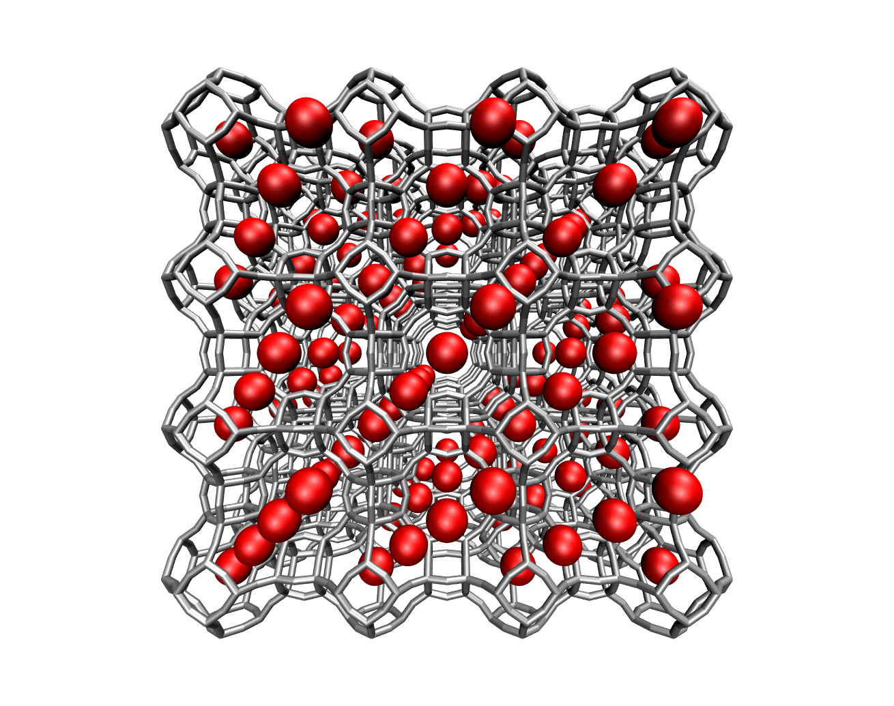

# NISTADS: NIST/ARPA-E dataset composer and modeling

## 1. Introduction
The NISTADS project delves into the fascinating world of adsorption, a surface-based process where a film of particles (adsorbate) accumulate on the surface of a material (adsorbent). This phenomenon plays a pivotal role in numerous industries. For instance, it is widely applied in water treatment facilities for the purification of water, in air filters to improve air quality, and in the automotive industry within catalytic converters to reduce harmful emissions. The adsorption of compounds is usually quantified by measuring the adsorption isotherm a given adsorbate/adsorbent combination. The objective of this project is two-fold: 1) to collect adsorption isotherms data from the NIST/ARPA-E Database of Novel and Emerging Adsorbent Materials (https://adsorption.nist.gov/index.php#home) through their dedicated API; 2) build a machine learning model that can accurately predict the adsorbed amount of a specific guest-host combination under various conditions, by leveraging the data from the NIST/ARPA-E Database.

This could have significant implications for industries that rely on these materials, potentially leading to more efficient processes and better materials design. As such, this project takes a different approach compared to fitting adsorption data with theoretical model for adsorption constants calculation, instead proposing the use of a deep learning approach to understand adsorption isotherm patterns by leveraging a large volume of experimental data.

  

## 2. Adsorption datasets
Users can collect data on adsorbent materials and adsorbate species, along with adsorption isotherm experiments. The data is retrieved asynchronously to enhance processing speed. Conveniently, the app will split adsorption isotherm data in two different datasets (Single Component ADSorption and Binary Mixture ADSorption). Since NISTADS is focused on predicting single component adsorption isotherms, it will make use of the single component dataset (SCADS) for the model training. As the NIST-ARPA-E database does not provide chemical information for either adsorbate species or adsorbent materials, these details are gathered from external sources. For adsorbate species, NISTADS utilizes the PUG REST API (see PubChemPy documentation for more details) to enrich the dataset with molecular properties such as molecular weight and canonical SMILES. However, obtaining information on adsorbent materials is more challenging, as no publicly available API offers this data. 

- **Data preprocessing:** The single-component adsorption dataset is processed through a custom pipeline. Initially, experiments containing negative values for temperature, pressure, or uptake are removed, along with any measurements falling outside predefined pressure and uptake boundaries (as specified in the configuration). Next, pressure and uptake values are standardized to consistent units — Pascals for pressure and mol/g for uptake. After this refinement, the dataset is enriched with molecular properties, including molecular weight and SMILES representations for both adsorbate species and adsorbent materials. The pressure and uptake series are then normalized using predefined upper bounds as ceilings. Finally, all sequences are reshaped to a uniform length via post-padding and re-normalized to ensure consistency across the dataset.

## 3. Machine learning model
SCADS (Single Component ADSorption) is a deep learning model specifically developed to predict adsorption isotherms for porous materials using a variety of molecular and experimental descriptors. At its core, SCADS leverages the flexibility and power of transformer-based neural architectures to learn complex, physically meaningful relationships between chemical structures, material classes, experimental state variables, and pressure conditions.

SCADS takes as input a detailed set of features describing the adsorption system, including the adsorbate SMILE sequence and molecular weight, the categorically-encoded adsorbents, the experiment temperature and the pressure series over which the adsorption isotherm is to be predicted. Each of these components is embedded into a shared, high-dimensional space using learnable neural embeddings. For sequential inputs such as SMILES, positional encodings are also added to preserve the order and meaning of the sequence. Masking mechanisms are built in to ensure that padding values do not contaminate the learned representations.

Once embedded, these features are processed through a series of transformer encoder layers, using multi-head self-attention to capture intricate dependencies within and between the different molecular and contextual descriptors. In parallel, a dedicated state encoder transforms experimental state variables, such as temperature, into dense vectors that the model can use to modulate its predictions.

A unique aspect of SCADS is its pressure series encoder, which applies cross-attention between the input pressure series and the context-rich molecular representation produced by the previous layers. This design enables the model to dynamically adapt its predictions to changing pressure conditions, which is essential for accurately modeling adsorption isotherms across a broad range of experimental scenarios. The final decoder head, known as the Q Decoder, combines the encoded pressure and state information and transforms them through a series of dense layers. Temperature and other state variables are incorporated via scaling mechanisms to ensure that predictions remain physically plausible (higher temperature would correspond to lower uptake)

## 4. Installation
The installation process for Windows is fully automated. Simply run the script *start_on_windows.bat* to begin. During its initial execution, the script installs portable Python, necessary dependencies, minimizing user interaction and ensuring all components are ready for local use.  

### 4.1 Just-In-Time (JIT) Compiler
This project leverages Just-In-Time model compilation through `torch.compile`, enhancing model performance by tracing the computation graph and applying advanced optimizations like kernel fusion and graph lowering. This approach significantly reduces computation time during both training and inference. The default backend, TorchInductor, is designed to maximize performance on both CPUs and GPUs. Additionally, the installation includes Triton, which generates highly optimized GPU kernels for even faster computation on NVIDIA hardware. 

## 5. How to use
On Windows, run *start_on_windows.bat* to launch the application. Please note that some antivirus software, such as Avast, may flag or quarantine python.exe when called by the .bat file. If you encounter unusual behavior, consider adding an exception in your antivirus settings.

The main interface streamlines navigation across the application's core services, including dataset evaluation, model training and evaluation, and inference. Users can easily visualize generated plots and browse both training and inference images. Models training supports customizable configurations and also allows resuming previous sessions using pretrained models.

**Dataset collection, validation and processing:** extract data from the NIST database and organize it into a structured format. Data retrieval is performed concurrently via the NIST/ARPA-E Database API, enabling fast access by maximizing parallel HTTP requests. Once the core dataset is collected, additional molecular properties of adsorbates are fetched using the Pug REST API and integrated into the main database. 

Once data is collected, one can analyze and validate the dataset with different metrics, such as:

- **Clustering of adsorption isotherms**: use Dynamic Time Warping (DTW) on pressure series to clusterize adsorption isotherms based on curve shapes

Eventually, it is possible to build the training dataset that will be used to train the SCADs model on single component adsorption isotherms data. Experiments will be processed through the following steps:
- **Aggregation of single measurments**
- **Addition of chemical properties based on adsorbent and adsorbate species**
- **Encoding SMILE sequences with a regex-based tokenizer**
- **Conversion of units (Pa for pressure, mol/g for uptake)**
- **Filtering experiments with too few points, out of boundaries values, trailing zeros**
- **Train and validation dataset splitting**

**Model:** through this tab one can train the SCADS model from scratch or resume training for previously trained checkpoints. Moreover, this section provides both model inference and evaluation functionalities. Use the pretrained checkpoint to predict uptake from given experimental condition and pressure. The SCADS model can be evaluated using different metrics, such as:

- **Average mean squared error loss and R square** 
- **Comparison of predicted vs true adsorption isotherms** 

**Viewer:** visualize training metrics in real-time 

## 5.1 Setup and Maintenance
You can run *setup_and_maintenance.bat* to start the external tools for maintenance with the following options:

- **Update project:** check for updates from Github
- **Remove logs:** remove all logs file from *resources/logs*

### 5.2 Resources
This folder organizes data and results across various stages of the project, such as data validation, model training, and evaluation. By default, all data is stored within an SQLite database. To visualize and interact with the SQLite database, we recommend downloading and installing the DB Browser for SQLite, available at: https://sqlitebrowser.org/dl/. The directory structure includes the following folders:

- **checkpoints:**  pretrained model checkpoints are stored here, and can be used either for resuming training or performing inference with an already trained model.

- **database:** collected adsorption data, processed data and validation results will be stored centrally within the embedded SQLite database *NISTADS_database.db*. All associated metadata will be promptly stored in *database/metadata*. Validation outputs will be saved separately within *database/validation*. Source data, such as datasets for inference or additional adsorption isotherm data for the training dataset is located in *database/dataset* (a template of the expected datasets is available in *templates*). 

- **logs:** log files are saved here

- **templates:** reference template files can be found here

**Environmental variables** are stored in the *app* folder (within the project folder). For security reasons, this file is typically not uploaded to GitHub. Instead, you must create this file manually by copying the template from *resources/templates/.env* and placing it in the *app* directory.

| Variable              | Description                                      |
|-----------------------|--------------------------------------------------|
| KERAS_BACKEND         | Sets the backend for Keras, default is PyTorch   |
| TF_CPP_MIN_LOG_LEVEL  | TensorFlow logging verbosity                     |
| MPLBACKEND            | Matplotlib backend, keep default as Agg          |

## 6. License
This project is licensed under the terms of the MIT license. See the LICENSE file for details.

